# Redis Prompt Caching — 完整时序图

## 架构概览

SmartFin 使用 Redis 对 **4 个 LLM 调用点** 做响应缓存，避免重复的 Anthropic API 调用。缓存以 **SHA-256 哈希输入文本** 为键，**TTL = 1 小时**，Redis 不可用时静默降级（best-effort）。

---

## 时序图

```mermaid
sequenceDiagram
    autonumber
    actor User as 👤 用户
    participant UI as 🖥️ UI (React/Vite)
    participant API as ⚡ FastAPI Backend
    participant Orch as 🧠 Orchestrator<br/>(LangGraph)
    participant IC as 🏷️ Intent Classifier
    participant Agent as 🤖 Specialist Agent<br/>(Extractor)
    participant Cache as 📦 Cache Module<br/>(app/tools/cache.py)
    participant Redis as 🗄️ Redis<br/>(Docker)
    participant LLM as ☁️ Anthropic API<br/>(Claude)

    %% ═══════════════════════════════════════════
    %% Phase 1: 用户发起请求
    %% ═══════════════════════════════════════════
    rect rgb(240, 248, 255)
        Note over User,Redis: 📨 Phase 1 — 用户发起请求
        User->>UI: 输入自然语言消息<br/>例: "save $1000 by June for iPhone"
        UI->>API: POST /chat {message, thread_id}
        API->>Orch: app_graph.invoke(messages, config)
    end

    %% ═══════════════════════════════════════════
    %% Phase 2: Intent Classification with Cache
    %% ═══════════════════════════════════════════
    rect rgb(255, 250, 240)
        Note over Orch,LLM: 🔀 Phase 2 — 意图分类 (Intent Classification)
        Orch->>IC: classify_intent(message)

        IC->>Cache: get_cached_llm_response(<br/>"intent_classifier", message)
        Cache->>Cache: _build_key():<br/>SHA-256(message) → "llm:intent_classifier:<digest>"
        Cache->>Redis: GET llm:intent_classifier:<digest>

        alt ✅ Cache HIT
            Redis-->>Cache: cached JSON {"agent": "goal_planning"}
            Cache-->>IC: return {"agent": "goal_planning"}
            IC-->>Orch: return "goal_planning"
            Note over IC,Redis: 🎯 命中缓存，跳过 LLM 调用

        else ❌ Cache MISS
            Redis-->>Cache: nil
            Cache-->>IC: return None

            IC->>LLM: ChatAnthropic.with_structured_output()<br/>model: resolve_model_name("intent")
            LLM-->>IC: _IntentResult {agent, reasoning}

            alt LLM 返回 "unknown"
                IC->>IC: _keyword_fallback(message)<br/>关键词匹配兜底
                Note over IC: 例: "save"/"goal" → goal_planning
                IC->>Cache: cache_llm_response(<br/>"intent_classifier", message,<br/>{"agent": fallback_agent})
                Cache->>Redis: SET llm:intent_classifier:<digest><br/>value=JSON, EX=3600
            else LLM 返回有效 agent
                IC->>Cache: cache_llm_response(<br/>"intent_classifier", message,<br/>{"agent": result.agent})
                Cache->>Redis: SET llm:intent_classifier:<digest><br/>value=JSON, EX=3600
            end

            IC-->>Orch: return agent_name
        end
    end

    %% ═══════════════════════════════════════════
    %% Phase 3: Route to Specialist Agent
    %% ═══════════════════════════════════════════
    rect rgb(240, 255, 240)
        Note over Orch,Agent: 🎯 Phase 3 — 路由到专业 Agent
        Orch->>Orch: route_to_agent(agent_name)
        Orch->>Agent: run(AgentStateView)
    end

    %% ═══════════════════════════════════════════
    %% Phase 4: Agent Extraction with Cache (3 agents use this)
    %% ═══════════════════════════════════════════
    rect rgb(255, 245, 255)
        Note over Agent,LLM: 🔍 Phase 4 — Agent 数据提取 (Extractor + Cache)

        alt Transaction Extractor (expense_analysis)
            Agent->>Agent: _quick_filter(message)<br/>快速关键字预筛选
            Note over Agent: 不含金额/商家关键字 → 跳过 LLM

            Agent->>Cache: get_cached_llm_response(<br/>"transaction_extractor", message)
            Cache->>Redis: GET llm:transaction_extractor:<digest>

            alt ✅ Cache HIT
                Redis-->>Cache: cached JSON
                Cache-->>Agent: return [Transaction, ...]
                Note over Agent,Redis: 🎯 命中，跳过 LLM
            else ❌ Cache MISS
                Redis-->>Cache: nil
                Cache-->>Agent: return None
                Agent->>LLM: ChatAnthropic.with_structured_output()<br/>→ _TxnExtract schema
                LLM-->>Agent: {transactions: [{amount, category, ...}]}
                Agent->>Cache: cache_llm_response(<br/>"transaction_extractor", message,<br/>{"transactions": [...]})
                Cache->>Redis: SET llm:transaction_extractor:<digest><br/>value=JSON, EX=3600
            end

        else Budget Extractor (budget_planning)
            Agent->>Agent: 构建 cache_key =<br/>"{message}|{income}|{context}"
            Agent->>Cache: get_cached_llm_response(<br/>"budget_request_extractor", cache_key)
            Cache->>Redis: GET llm:budget_request_extractor:<digest>

            alt ✅ Cache HIT
                Redis-->>Cache: cached JSON
                Cache-->>Agent: return {intent, monthly_income, ...}
                Note over Agent,Redis: 🎯 命中，跳过 LLM (含重试)
            else ❌ Cache MISS
                Redis-->>Cache: nil
                Cache-->>Agent: return None

                loop 最多 3 次重试 (指数退避)
                    Agent->>LLM: ChatAnthropic.with_structured_output()<br/>→ BudgetRequest schema
                    alt 成功
                        LLM-->>Agent: {monthly_income, categories_requested, ...}
                    else 失败
                        LLM-->>Agent: Exception
                        Agent->>Agent: time.sleep(2^(attempt-1) × 初始退避)
                    end
                end

                Agent->>Cache: cache_llm_response(<br/>"budget_request_extractor", cache_key, output)
                Cache->>Redis: SET llm:budget_request_extractor:<digest><br/>value=JSON, EX=3600
            end

        else Goal Extractor (goal_planning)
            Agent->>Agent: 构建 cache_key =<br/>"{message}|{today}|{context}"
            Agent->>Cache: get_cached_llm_response(<br/>"goal_extractor", cache_key)
            Cache->>Redis: GET llm:goal_extractor:<digest>

            alt ✅ Cache HIT
                Redis-->>Cache: cached JSON
                Cache-->>Agent: return GoalExtractionResult
                Note over Agent,Redis: 🎯 命中，跳过 LLM (含重试)
            else ❌ Cache MISS
                Redis-->>Cache: nil
                Cache-->>Agent: return None

                loop 最多 3 次重试 (指数退避)
                    Agent->>LLM: ChatAnthropic.with_structured_output()<br/>→ GoalExtractionResult schema
                    alt 成功
                        LLM-->>Agent: {name, target_amount, target_date, ...}
                        Agent->>Agent: _normalize_missing_fields()
                    else 失败
                        LLM-->>Agent: Exception
                        Agent->>Agent: time.sleep(2^(attempt-1) × 初始退避)
                    end
                end

                Agent->>Cache: cache_llm_response(<br/>"goal_extractor", cache_key,<br/>result.model_dump())
                Cache->>Redis: SET llm:goal_extractor:<digest><br/>value=JSON, EX=3600
            end
        end
    end

    %% ═══════════════════════════════════════════
    %% Phase 5: Response Assembly & Return
    %% ═══════════════════════════════════════════
    rect rgb(255, 255, 240)
        Note over Agent,User: 📤 Phase 5 — 响应组装与返回
        Agent-->>Orch: return agent result dict
        Orch->>Orch: memory_saver → persist state
        Orch-->>API: return updated AppState
        API-->>UI: JSON response
        UI-->>User: 渲染结果
    end

    %% ═══════════════════════════════════════════
    %% Phase 6: Redis 故障降级
    %% ═══════════════════════════════════════════
    rect rgb(255, 235, 235)
        Note over Cache,Redis: ⚠️ 降级路径 — Redis 不可用时
        Cache->>Redis: GET / SET (任何操作)
        Redis-->>Cache: ConnectionError / TimeoutError
        Cache->>Cache: _redis = False<br/>logger.warning("Redis unavailable, caching disabled")
        Note over Cache: get_cached_llm_response → 永远返回 None<br/>cache_llm_response → 静默跳过<br/>（不影响主流程，仅失去缓存加速）
    end
```

---

## 缓存键设计

| 缓存命名空间 | 键格式 | 使用方 |
|---|---|---|
| `llm:intent_classifier` | `SHA-256(message)` | Orchestrator → Intent Classifier |
| `llm:transaction_extractor` | `SHA-256(message)` | expense_analysis Extractor |
| `llm:budget_request_extractor` | `SHA-256("{message}\|{income}\|{context}")` | budget_planning Extractor |
| `llm:goal_extractor` | `SHA-256("{message}\|{today}\|{context}")` | goal_planning Extractor |

> **TTL**: 统一 3600 秒（1 小时）

---

## 关键设计要点

1. **Best-Effort 语义**：`cache.py` 中所有 Redis 操作都不抛异常 — 连接失败时 `_redis = False`，后续读写静默跳过
2. **懒连接**：Redis 连接在第一次 `get_cached_llm_response` 或 `cache_llm_response` 调用时才建立，不堵塞启动
3. **连接超时**：`socket_connect_timeout=2` 秒，避免 Redis 不可用时长时间阻塞
4. **幂等键**：SHA-256 哈希确保相同输入产生相同缓存键；`budget_request_extractor` 和 `goal_extractor` 额外拼接 `income`/`today`/`context` 到 key 中，保证输入变化时不会命中过期缓存
5. **重试后写入**：`budget_request_extractor` 和 `goal_extractor` 在带指数退避的重试成功后才写入缓存，避免缓存 LLM 失败时的中间状态
6. **Docker 编排**：Redis 以 `redis:7-alpine` 运行，AOF 持久化（`--appendonly yes`），backend 依赖 Redis 健康检查通过后才启动
